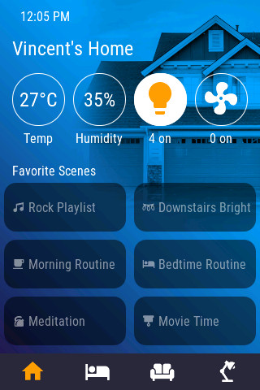
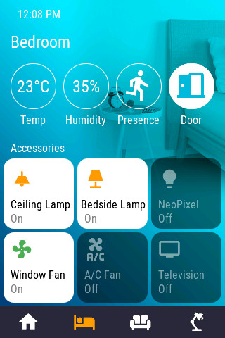
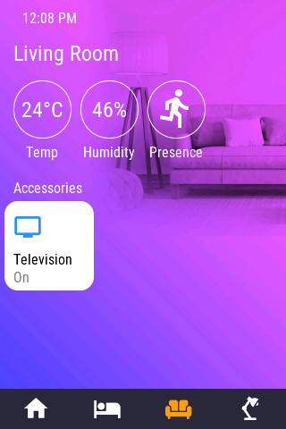
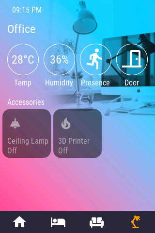
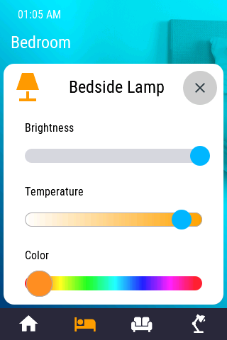
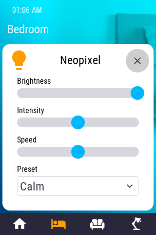
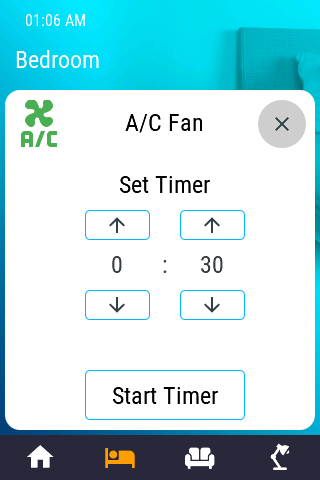
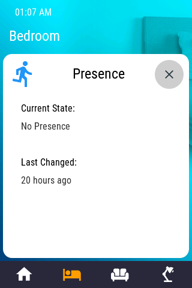
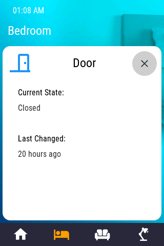
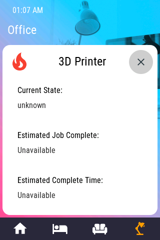

# OpenHASP "HomeKit" cards

Homekit-based cards for openHasp, based on 320x480 displays (like the Wireless Tag WT32-SC01)

Single tap toggles the device on/off. Holding the icon displays an appropriate popup for that card. See screenshots below!

## Installation

1. [Set up openHasp](https://www.openhasp.com/0.6.3/getting-started/) on your device. Select material light as your theme.
2. Copy the content of `pages.jsonl` to your device. Upload the required background images.
3. Copy `openhasp_homekit.yaml` to your homeassistant folder. Edit and replace all instances of `plate04` to the name of your openhasp device
4. Edit your `configuration.yaml` and add the following:

```
homeassistant:
  packages:
    openhasp_homekit: !include openhasp_homekit.yaml
```

Restart your device then restart home assistant. You should be ready to give this project a try!


## Configuration Notes

All of the popup cards (except for the 3D Printer one) are defined as 'scripts'. This is so we can reuse them multiple time without having to copy/paste the jsonl syntax over.

You can choose to use either gradient colors or images as your background. It should be noted that pages with gradients tends to load much faster than pages with backgrounds.

When defining your own background/gradients, you will need to use a color picker for the Door/Presence icon color. That is the only icon that needs a color defined, everything else works properly with transparency.


## Screensots

### page 1 and page 2
  

### page 3 and page 4
  

### Light popup card / WLED popup card
The light popup card can be used to change the Brightness, Temperature or Color of a light source that supports it.
The WLED popup shows controls for a WLED based light source. Brightness, Intensity, Speed and Preset can be adjusted  
    

### Timer popup card / Thermostat popup card     
Can be used to delay the shutdown of an appliance                           
    

### Binary popup
Shows the current state of a binary device and the last time it was changed.                      
  

### 3D Printer popup card
Shows the current state, print percentage and estimated completed time of a running print job                   
 

