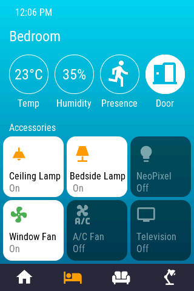
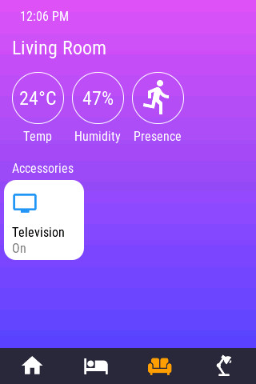

# openHASP HomeKit cards

Here is my second configuration for openHASP. It uses a 320x480 TFT lcf from a Wirelass Tag module (wt32-sc01).
All of the look/feel inspired by Apple HomeKit

## How to use

[Set up openHasp](https://www.openhasp.com/0.6.3/getting-started/) on your device. Select material light as your theme

If you just want to see how it looks on the device, [copying the content of pages.jsonl](https://www.openhasp.com/0.6.3/faq/#is-there-a-file-browser-built-in) to the microcontroller should be enough to get you started.

For a more complete installation, you will need to integrate the content of configuration.yaml to your own configuration.yaml, with taking care to replace all the entities id with your own.

## Where is the rest of the configuration file?

It is still a work in progress

## Screensots

page 1

page 2

page 3

page 4

