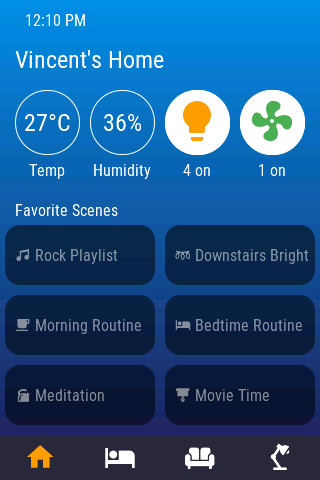
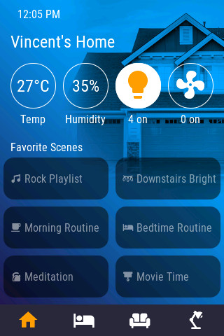
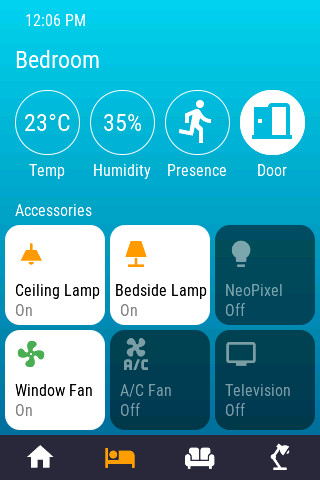
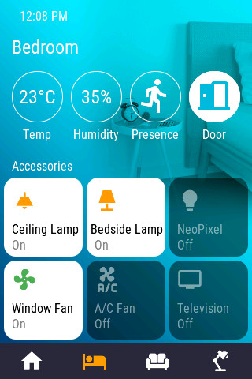
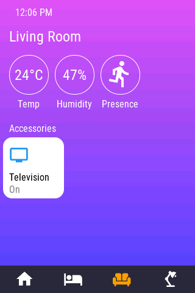
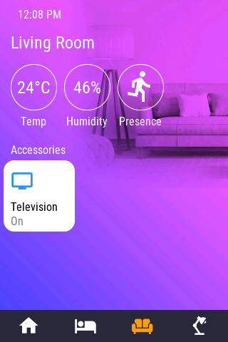
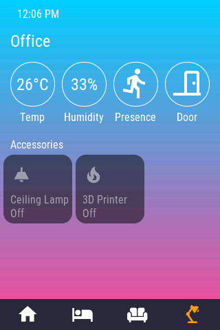
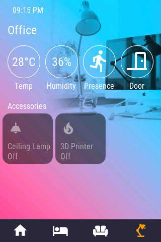

# openHASP "HomeKit" cards

Here is my second configuration for openHASP. It also uses a 320x480 TFT lcf from a Wirelass Tag module (wt32-sc01).
All of the look/feel inspired by Apple HomeKit

## How to use

[Set up openHasp](https://www.openhasp.com/0.6.3/getting-started/) on your device. Select material light as your theme

If you just want to see how it looks on the device, [copying the content of pages.jsonl](https://www.openhasp.com/0.6.3/faq/#is-there-a-file-browser-built-in) to the microcontroller should be enough to get you started.

For a more complete installation, you will need to integrate the content of configuration.yaml to your own configuration.yaml, with taking care to replace all the entities id with your own.

You can choose to use either gradient colors or images as your background. It should be noted that pages with gradients tends to load much faster than pages with backgrounds.

When defining your own background/gradients, you will need to use a color picker for the Door/Presence icon color. That is the only icon that needs a color defined, everything else works properly with transparency.

## Where can I get the backgrounds?

The backgrounds can be downloaded from [this reddit thread](https://www.reddit.com/r/HomeKit/comments/kvwv3z/part_2_more_rooms_colorful_custom_homekit/). They will need to be resized/cropped accordingly and saved as a PNG. Use the following syntax in your `pages.jsonl`:

```
{"page":1,"id":1,"obj":"img","src":"L:/hk-House.png","auto_size":0,"w":320}
{"page":2,"id":1,"obj":"img","src":"L:/hk-Bedroom.png","auto_size":0,"w":320}
{"page":3,"id":1,"obj":"img","src":"L:/hk-Living_Room.png","auto_size":0,"w":320}
{"page":4,"id":1,"obj":"img","src":"L:/hk-Office_1.png","auto_size":0,"w":320}
```

## Screensots

page 1





page 2





page 3





page 4




