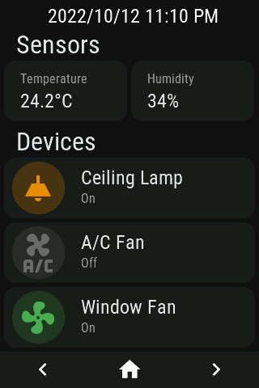
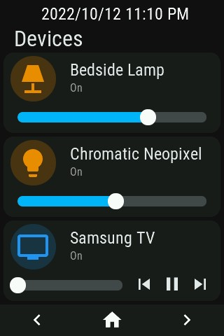
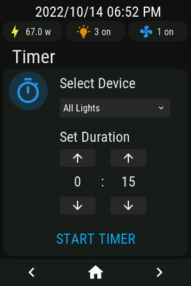
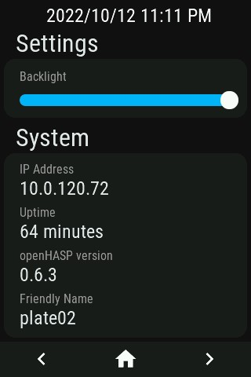

Here is my personal configuration for openHASP, using a 320x480 TFT lcd. 
Look/feel inspired by the excellent Mushroom cards for Home Assistant.

Notes: 
 - The page3 "Timer" functionality is still a work in progress
 - Media controls for the Samsung TV on page 2 aren't implemented

page 1

page 2

page 3

page 4

